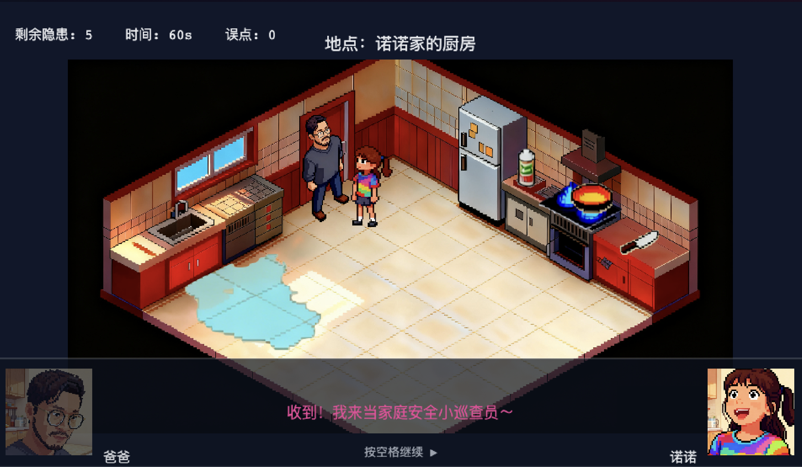

家庭安全巡查官（厨房篇）

简介
- 一款基于 Phaser 3 的 2D 小游戏：在限定时间内，发现厨房里的安全隐患并进行科普互动。
- 当前包含一个教学关卡与基础菜单/结算页面，支持对话、音效、背景音乐与角色移动。

环境要求
- Node.js 16+（推荐 18/20）
- npm（或兼容的包管理器）

安装与启动
1. 安装依赖
   - 运行：`npm install`
2. 启动开发服务器
   - 运行：`npm run dev`
   - 默认地址：`http://localhost:5173`
3. 构建生产版本（可选）
   - 运行：`npm run build`
   - 本地预览：`npm run preview`

如何游玩（操作与规则）
- 目标：在时间耗尽前找出场景中的全部隐患。
- 移动：键盘方向键（↑↓←→）。
- 检查：靠近目标后按空格键确认；不在附近按空格会判定为误点并扣时。
- 对话：出现对话时，空格仅用于推进，不会触发检查。
- 评分：根据剩余时间与误点次数评定等级。

资源放置约定
- 图片、音效等静态资源放在 `public/` 下，例如：
  - 背景：`public/images/levels/lv1/bg.png`
  - 隐患贴图：`public/images/levels/lv1/sprites/*.png`
  - 音效/音乐：`public/audio/*.mp3`
- 以 `/` 开头的路径会从 `public/` 作为站点根路径进行访问（Vite 约定）。

常见问题
- 浏览器自动播放限制导致音乐不响：请先点击页面任意位置；或查看控制台日志（已内置自动解锁与点击兜底）。
- 资源 404：确认资源已放到 `public/`，并使用以 `/` 开头的绝对路径引用。

项目结构（简）
- `src/scenes/MenuScene.js` — 主菜单与玩法说明
- `src/scenes/LevelScene.js` — 核心关卡：背景、隐患、角色、计时与对话
- `src/systems/dialogue.js` — 对话系统（文本滚动、头像与姓名标签）
- `src/systems/multiframe.js` — 多图帧动画/循环工具
- `src/state/levels.js` — 关卡数据（对话、隐患坐标、演员与触发）
- `src/scenes/ResultScene.js` — 结算页（胜利/失败音乐、知识点总结、重试）

AI 技术与流程（示例）
- 策划思路：使用“元宝”等对话式 AI 进行需求讨论与逐步细化，形成玩法与关卡脚本。
- 美术素材：使用“豆包”的图像/视频生成功能产出。人物素材通过上传本人与父亲的照片让 AI 生成符合视角的图片；再基于生成视频配合 AI 抠图，导出可动的精灵序列。
- 音乐音效：使用 Suno 生成像素风格背景音乐（BGM）与胜利/失败音效。
- 编码实现：借助 AI 编程工具完成场景、对话系统、输入与碰撞、UI/音频管线等逻辑与功能搭建。

许可
- 仅供教育演示与个人项目使用。第三方素材（图片/音频）版权归原作者所有，请在您的项目中替换或获得授权。
